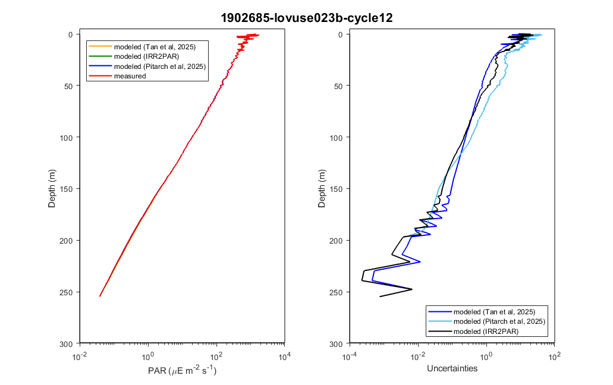

# matIRR2PAR
Calculation of PAR from multispectral irradiance profiles according to Argo recommendations (MATLAB version)

**⚠️ Under Validation (Do Not Use Yet)**
This code is currently under review and validation. It is not yet ready for use. Please check back later for updates

the Python version is [here](https://github.com/euroargodev/pyIRR2PAR)

# Objectives and Background
The Photosynthetically Available Radiation (PAR) is a radiometric parameter that has been measured on floats since the beginning of the BGC mission. It is particularly important to estimate Primary Production or to help for Chla processing. This parameter was traditionally measured using the OCR504 radiometer and was typically associated with wavelengths:  380, 412, and 490 nm. In accordance with the recommendations approved during AST-24, this configuration was replaced by: 380, 443, 490, and 555 nm (without direct PAR measurement) due to new scientific applications and the potential ability to derive PAR measurements from the four measured wavelengths [Organelli_WG_Radiometry_AST24_20March2023.pdf](https://drive.google.com/file/d/1HhDM9NZMGbhgXSlx_RA4Nooc2g_KlGUH/view?usp=sharing). 

The purpose of this Python code is to provide a wrapper for the two models evaluated within the Argo framework. It uses as input a matrix of four irradiance values at **380, 443, 490, and 555 nm**, along with the associated depth vector, and calculates the outputs of both models as well as the average of the calculated PAR values, which is the PAR estimate to be considered as recommended during ADMT26 [ADMT26-Leymarie-PAR Model.pptx](https://docs.google.com/presentation/d/1edo8Na_IFxEJGKgBwDNWRhW9zqafZP9W/edit?usp=drive_link&ouid=112140535291181030156&rtpof=true&sd=true).

# Usage
```
[JTan_PAR_results, JPitarch_PAR_results, mean_PAR, mean_uncertainty] = IRR2PAR(Ed, z)

Parameters:
* Ed -- N x 4 array  [Ed380, Ed443, Ed490, Ed555] in W/m²/nm
* z  -- N x 1 array   depth (m)

Returns: 
* JTan_PAR_results     -- cell {JTan_PAR, JTan_e}
* JPitarch_PAR_results -- cell {JPitarch_PAR, JPitarch_PAR_b, JPitarch_ep50, JPitarch_IQR_ep, JPitarch_e}
* mean_PAR             -- N x 1  The average PAR values from both models (excluding NA/NaN values). This is the PAR value recommended under the Argo framework.
* mean_uncertainty     -- N x 1  combined uncertainty
```
All PAR values are in microMoleQuanta/m^2/sec

Here is an example:
```
Ed = [3.1477e-07, 4.401e-05, 0.00031093, 2.6219e-05;
       0.0097528,  0.061085,  0.10562,    0.087316;
       0.20572,    0.52315,   0.54544,    0.16185];
 z = [84.8; 14.2; 28.1];

[JTan_PAR_results, JPitarch_PAR_results, mean_PAR, mean_uncertainty] = IRR2PAR(Ed, z)
```

A more realistic example:
```
% Read example data:
% 1st column - depth, 2nd - PAR (micro E/m2/s)
% 3rd - 6th columns: Ed380 (mW/cm2/micron), Ed443 (mW/cm2/micron), Ed490 (mW/cm2/micron), Ed555 (mW/cm2/micron)

filename = '1902685-lovuse023b-cycle12.csv';
df = readtable(filename);

Ed         = [df.Ed_380, df.Ed_443, df.Ed_490, df.Ed_555];
depth      = df.depth;
ramses_par = df.RamsesPAR; % Measured PAR (micro E/m2/s)

[JTan_PAR_results, JPitarch_PAR_results, mean_PAR, mean_uncertainty] = IRR2PAR(Ed, depth);


% --- Figure ---
fig = figure('Units', 'inches', 'Position', [1, 1, 14, 6],'Color', 'white');
sgtitle('1902685-lovuse023b-cycle12', 'FontSize', 16, 'FontWeight', 'bold')

% --- Subplot 1: PAR values ---
ax1 = subplot(1, 2, 1);
set(ax1, 'XScale', 'log')
hold(ax1, 'on');
semilogx(ax1, JTan_PAR_results{1},     depth, 'Color', [1.0, 0.65, 0.0], 'LineWidth', 1.5, 'DisplayName', 'modeled (Tan et al, 2025)');
semilogx(ax1, mean_PAR,     depth, 'Color', [0.0, 0.5,  0.0], 'LineWidth', 1.5, 'DisplayName', 'modeled (IRR2PAR)');
semilogx(ax1, JPitarch_PAR_results{1}, depth, 'Color', [0.0, 0.0,  1.0], 'LineWidth', 1.5, 'DisplayName', 'modeled (Pitarch et al, 2025)');
semilogx(ax1, ramses_par,   depth, 'Color', [1.0, 0.0,  0.0], 'LineWidth', 1.5, 'DisplayName', 'measured');
xlabel(ax1, 'PAR (\muE m^{-2} s^{-1})');
ylabel(ax1, 'Depth (m)');
lg1 = legend(ax1, 'Location', 'northwest');
lg1.BoxFace.ColorType = 'truecoloralpha';
lg1.BoxFace.ColorData = uint8([255 255 255 180]');
set(ax1, 'YDir', 'reverse', 'TickDir', 'out', 'Box', 'off', ...
    'XAxisLocation', 'bottom', 'YAxisLocation', 'left');
ylim(ax1, [0, 300]);

% --- Subplot 2: Uncertainties ---
ax2 = subplot(1, 2, 2);
set(ax2, 'XScale', 'log')
hold(ax2, 'on');
semilogx(ax2, JTan_PAR_results{2},     depth, 'Color', [1.0, 0.65, 0.0], 'LineWidth', 1.5, 'DisplayName', 'modeled (Tan et al, 2025)');
semilogx(ax2, JPitarch_PAR_results{5}, depth, 'Color', [0.0, 0.0,  1.0], 'LineWidth', 1.5, 'DisplayName', 'modeled (Pitarch et al, 2025)');
semilogx(ax2, mean_uncertainty,   depth, 'Color', [0.0, 0.5,  0.0], 'LineWidth', 1.5, 'DisplayName', 'modeled (IRR2PAR)');
xlabel(ax2, 'Uncertainties');
ylabel(ax2, 'Depth (m)');
lg3 = legend(ax2, 'Location', 'southeast');
lg3.BoxFace.ColorType = 'truecoloralpha';
lg3.BoxFace.ColorData = uint8([255 255 255 180]');
set(ax2, 'YDir', 'reverse', 'TickDir', 'out', 'Box', 'off', ...
    'XAxisLocation', 'bottom', 'YAxisLocation', 'left');
ylim(ax2, [0, 300]);

annotation(fig, 'rectangle', ax1.Position, 'EdgeColor', 'k', 'LineWidth', 0.5);
annotation(fig, 'rectangle', ax2.Position, 'EdgeColor', 'k', 'LineWidth', 0.5);
```


# Bibliography
We would like to warmly thank Jaime Pitarch and Jing Tan for their work and for making their code available to the community.
* Pitarch, J., Leymarie, E., Vellucci, V., Massi, L., Claustre, H., Poteau, A., Antoine, D., Organelli, E., 2025. Accurate estimation of photosynthetic available radiation from multispectral downwelling irradiance profiles. Limnology and Oceanography: Methods. [https://doi.org/10.1002/lom3.10673](https://doi.org/10.1002/lom3.10673)
GitHub original repository : [PAR_BGC_Argo](https://github.com/euroargodev/PAR_BGC_Argo)
  
* Tan, J., Frouin, R., Leymarie, E., Mitchell, B.G., 2025. Modeling underwater photosynthetically available radiation profiles from biogeochemical Argo floats using multi-spectral irradiance measurements. Opt. Express, OE 33, 44355–44377. [https://doi.org/10.1364/OE.566083](https://doi.org/10.1364/OE.566083)
GitHub original repository : [BioArgo_PAR](https://github.com/jit079/BioArgo_PAR)

# How to cite this calculation
If you use this package, please cite the original work by J. Pitarch and J. Tan and note that the PAR estimate is the average of these two models.
